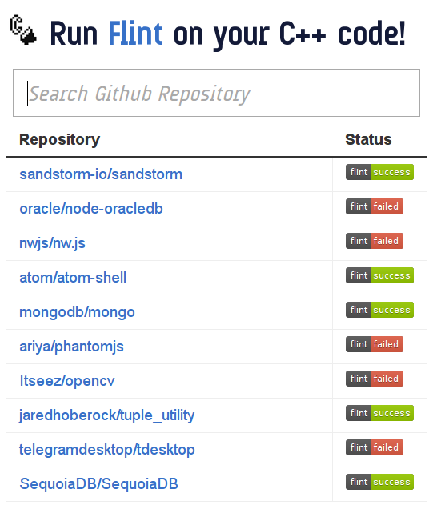

# flinter  [](https://travis-ci.org/lukasmartinelli/flinter) [](https://coveralls.io/r/lukasmartinelli/flinter) [](https://codeclimate.com/github/lukasmartinelli/flinter)

> :warning: This repository is no longer maintained by Lukas Martinelli.



## How it works

flinter works a bit differently - instead of receiving updates about a repo
via a webhook we just track all C++ repos via the [Github Realtime Realy](https://github.com/lukasmartinelli/ghrr).

## API

There is a single ressource `Repo` which encapsulates a repository
flinter keeps track of.

### List repositories

```
GET /repos
```

```json
[
    {
        "owner": "mongo",
        "name": "mongodb",
        "html_url": "https://github.com/mongo/mongodb",
        "clone_url": "https://github.com/mongo/mongodb.git",
        "status": "failed"
    },
    {
        "owner": "nathanepstein",
        "name": "markov",
        "html_url": "https://github.com/mongo/mongodb",
        "clone_url": "https://github.com/mongo/mongodb.git",
        "status": "success"
    }
]
```

### Search repo by name

```
GET /repos?q=mark
```

```json
[
    {
        "owner": "nathanepstein",
        "name": "markov",
        "html_url": "https://github.com/mongo/mongodb",
        "clone_url": "https://github.com/mongo/mongodb.git",
        "status": "success"
    }
]
```

### Get status badge for repo

```
GET /repos/:owner/:repository.svg?style=flat
```

### List commits

```
GET /repos/:owner/:repository/commits
```

```json
[
    {
        "sha": "6dcb09b5b57875f334f61aebed695e2e4193db5e",
        "date": "2011-04-14T16:00:49Z",
        "flint_output": [
            {
                "file": "root/src/sodium/api.h",
                "lineno": 1,
                "message": "Missing include guard"
            },
            {
                "file": "root/src/sandstorm/union-fs.c++",
                "lineno": 575,
                "message": "Single-argument constructor may be used as a type conversion constructor"
            }
        ],
        "flint_status": "failed"
    }
]
```

